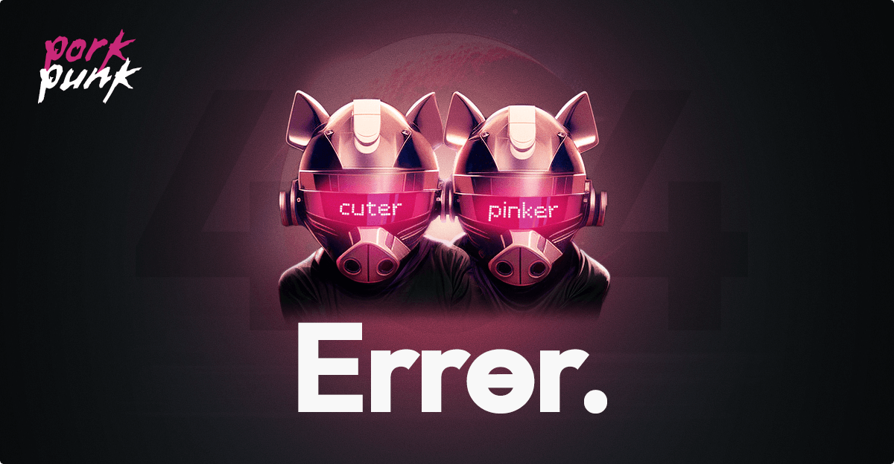
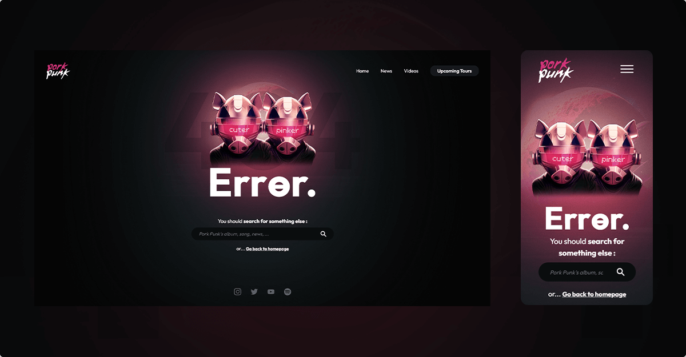

# [Pork Punk - 404 Error page](https://aelweak.github.io/porkpunk/)

## Contest details

-   **Brief :** Create a custom 404 error page
-   **Start :** Jan 23 (10 am), 2023
-   **End :** Feb 5 (11.59 pm), 2023
-   **Results :** 🥇1st place (out of 15)

<a href="https://discord.com/channels/655077317911117860/1041772720066674760/1067006280704720996" target="_blank">(More details on Discord)</a>

## Description/Features

Daft Punk's pig-double ? Done ✅🐷.

-   _"Harder, Better, Faster, Stronger"_ becomes... _"Cuter, Pinker, Clever, Tender"_ !
-   Still a reference to the original song with _"Err**θ**r"_ for reading/pronouncing _"Err**or**"_ **and** _"Err**er**"_ (like previous _"-er"_ adjectives)
-   A simple "static" and "classic" page structure, avoiding "eye distractions" (like auto-played animations or so) and keeping an easy-reading message  
    (That's why the `:hover` on pigs is also intentionally "inconspicuous", for example.)

-   The goal is not to stay on the page, but rather to navigate out of it in a "guided" way : through the main naviguation, search field, _"Go back to homepage"_ link or social media ones

-   Visual (and audio 🔊) easter egg by clicking on pigs

    I was a bit disappointed here... and didn't manage to exactly reproduce the "vocoder (audio) effect" on _"Cuter, Pinker, Clever, Tender"_ words, despite several attempts with _Ableton Live_...  
    (Only music, no voices then... Maybe next time...)

-   Auto `.focus()` on search field after a 10s delay of inactivity (to "gently" call to action)

# Preview(s)

